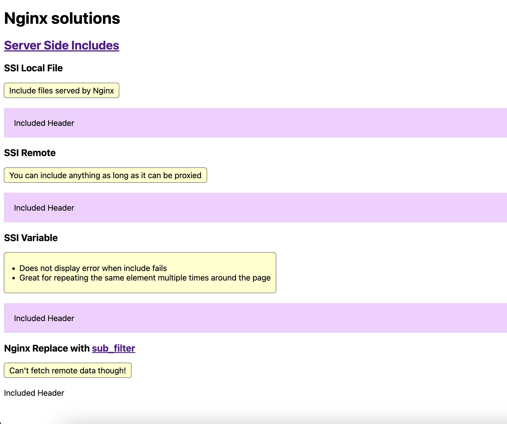
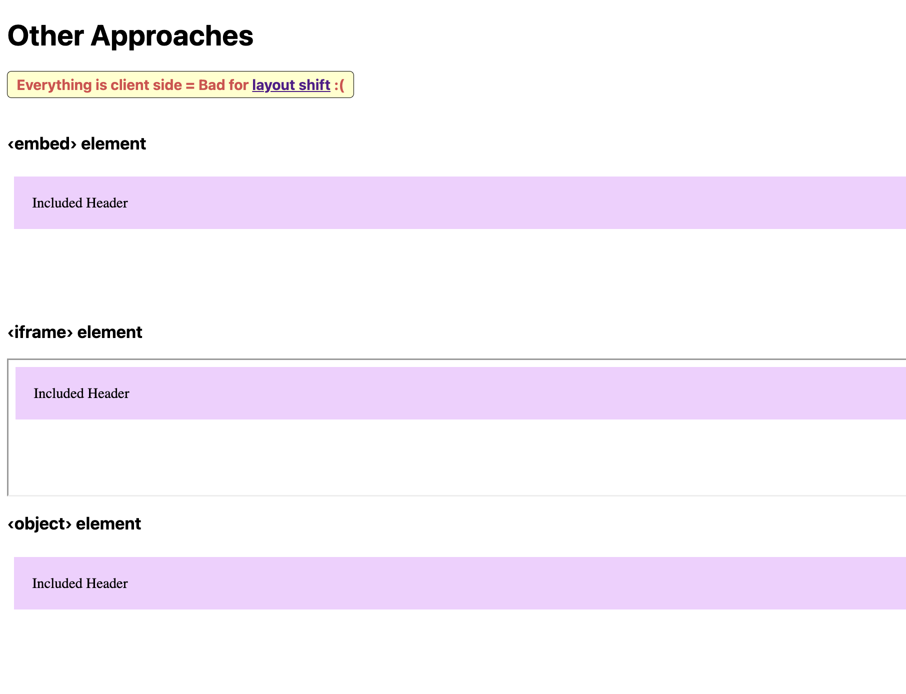
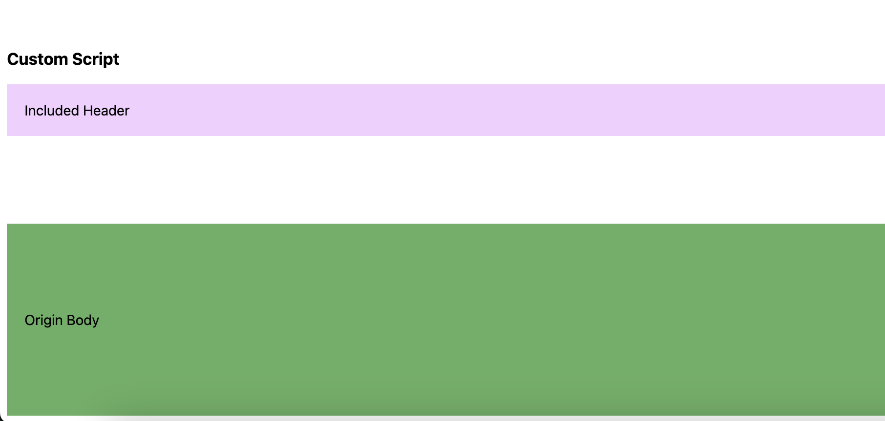

### A few examples of how to include partial HTML content inside another website without needing to heavily modify the origin server 🖼️

This might also come in handy when you want to distribute the same HTML content to multiple separate applications.

- Server-side rendering is achieved using an [Nginx proxy](./nginx/conf.d/default.conf)
- Client-side rendering showcases a few different ways

Check [index.html](./nginx/index.html) for all examples

Run demo with `docker compose up` and visit http://localhost:8001

